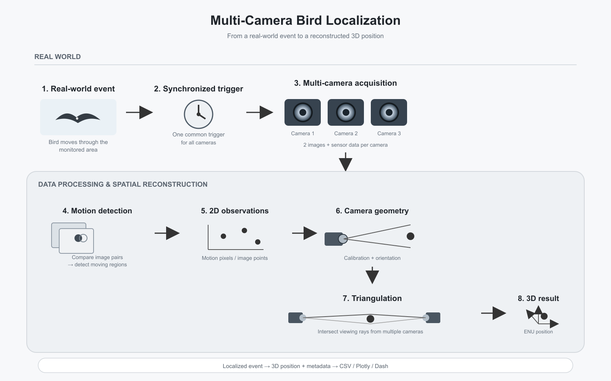

# Vogelerkennung

## Pipeline-Übersicht



Die Raspberry Pis nehmen nach einem gemeinsamen Trigger jeweils zwei Bilder auf und ergänzen diese um Kamera-, GPS-, Orientierungs- und Umweltdaten. Der Mainserver empfängt die Daten, erkennt Bewegungen zwischen den Bildern und berechnet aus den Bildpunkten und Kameradaten mögliche 3D-Positionen. Ergebnisse werden im Dashboard dargestellt und je nach Server-Version als CSV- oder JSONL-Daten gespeichert.

## Ordnerstruktur

```text
.
├── data/images/                 Pipeline-Abbildung
├── flugbahn_mockup/             Simulation und Visualisierung von Flugbahnen
├── main-server/                 Mainserver, Bildverarbeitung und Triangulation
├── pi1/                         Software für Raspberry Pi 1
├── pi2/                         Software für Raspberry Pi 2
├── pi3/                         Software für Raspberry Pi 3
├── ml_events.jsonl              Exportierte Ereignisdaten im JSONL-Format
└── umweltrover_code_issues.*    Hinweise zur Codeanalyse (Markdown und PDF)
```

## Mainserver

| Datei | Aufgabe |
|---|---|
| `main_server_2.py` | Zentrale Anwendung: sendet Aufnahme-Trigger, empfängt Bilder und Header der Pis, gruppiert sie zu Ereignissen, startet die Bildverarbeitung und Triangulation und stellt Ergebnisse im Dash-Dashboard dar. Speichert unter anderem Bilder, Header, Plots und Triangulationspunkte. |
| `mainserver_mit_json.py` | Alternative bzw. erweiterte Server-Version, die zusätzlich Ereignisdaten zeilenweise in `ml_events.jsonl` protokolliert. |
| `motion_detector.py` | Vergleicht zwei Bilder, filtert Bewegungsbereiche und gibt deren Bildkoordinaten als `MotionPixel`-Objekte zurück. Kann außerdem Debug-Differenzbilder speichern. |
| `triangulation_3.py` | Enthält Kamera- und Koordinatenberechnungen sowie die Triangulation der Bildpunkte zu räumlichen Positionen. Verwendet GPS, Orientierung und Kamerakalibrierung. |
| `ml_events.jsonl` | Ereignisdaten im JSONL-Format, insbesondere für die zusätzliche Ereignisprotokollierung der JSON-Server-Version. |
| `restart.sh` | Shell-Skript zum Neustarten des Serverdienstes. |
| `assets/style.css` | Zusätzliche Styles für die Weboberfläche. |

Beim laufenden Betrieb legt der Server außerdem Ereignisdateien und Plots an, zum Beispiel unter `images/<event_id>/`, Debugbilder unter `differenzbilder/` und Triangulationsergebnisse in `triangulation_results.csv`.

## Raspberry Pis

Die Ordner `pi1/`, `pi2/` und `pi3/` enthalten jeweils die Software für einen Kameraknoten. Die Sensor- und Orientierungsmodule sind grundsätzlich gleich aufgebaut; die Aufnahme-Clients können sich je nach Pi und eingesetztem Stand unterscheiden.

| Datei | Aufgabe |
|---|---|
| `pi_trigger_2pics_BGR.py` | Trigger-Client (Protokoll v2): wartet auf den Multicast-Trigger, nimmt zwei Bilder auf, erstellt den Daten-Header und überträgt Bilder und Header per TCP an den Mainserver. |
| `pi_client_final.py` | Weitere Client-Variante für Aufnahme und Übertragung. Welche Client-Datei gestartet wird, hängt vom verwendeten Installations- bzw. Pi-Stand ab. |
| `gps_reader.py` | Liest GPS-Daten ein und stellt Rohdaten sowie gemittelte Positionswerte für Client und Weboberfläche bereit. |
| `gps_reader.py.bak` | Sicherung einer älteren GPS-Reader-Version; keine reguläre Laufzeitdatei. |
| `orientation_reader.py` | Liest Yaw, Pitch und Roll vom Orientierungssensor über den ESP32/I2C aus und stellt gemittelte Werte bereit. |
| `orientation_web.py` | Lokale Diagnose-Weboberfläche für GPS, Orientierung und Umweltsensoren; stellt ausgewählte GPS- und Orientierungswerte für den Client bereit. |
| `BH1750.py` | Liest die Beleuchtungsstärke in Lux vom BH1750-Sensor aus. |
| `BME280.py` | Liest Temperatur, Luftdruck und relative Luftfeuchtigkeit vom BME280-Sensor aus. |

Die beiden Client-Dateien sollten nicht als gleichzeitig zu startende Programme verstanden werden: Pro Pi wird die zum jeweiligen Installationsstand passende Variante verwendet.
